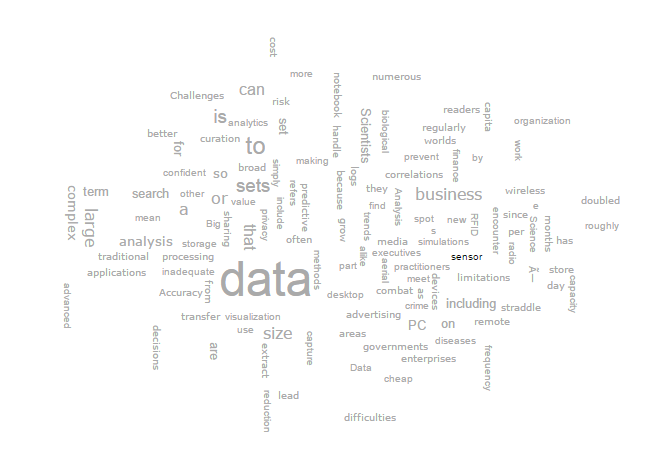
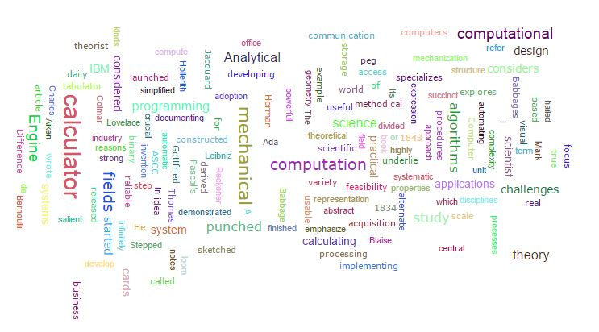

# Word Crowd
This is a <a href="http://wordcram.org/">WordCram</a>-inspired WordCrowd layout written in JavaScript.
 

 

## USAGE: 

Download zip or clone it using the following command.

`git clone https://github.com/project-spinoza/WordCrowd.git`

 Navigate to the examples directory and run the index.html file in web browser. 

## Running WordCrowd:

`var settings = {` 
       `"container":"body",` 
       `"data":"Input text data for visualization"` 
     `};`
 
`var wordCrowd = new WordCrowd(settings);`
## Settings:

There are some default settings for WordCrowd but they can be modify as follows

* <b>container</b>

Selector of the wordCrowd container element

default value  `body`

`container :  "#wordCrowdContainer"`

* <b>data</b>

The input text from which WordCrowd generates graph.

default value  `Input text data for visualization`

`data:  "Input text data for visualization"`

We can also give json data for generating graphs.

`data:  "[{word:'first word', size:12},{word:'second word', size:10}]"`

* <b>width</b>

Width of WordCrowd container.

default value  `800`

`width:800`

* <b>height</b>

Height of WordCrowd container.

default value  `600`

`height:600`

* <b>background :"white" </b>

Background color of WordCrowd container.

default value `"white" `

`background :"white"` 

* <b>fontsize_range</b>

The sizes of words. words of higher frequency get maximum font-size and lower frequency get minimum font-size. 

default value `{ min : 12, max : 36 } `

`fontsize_range : { min : 12, max : 36 }` 

* <b>hover_color</b>

Mouse hover color of words in Wordcrowd.

default value `"#000000"`

`hover_color :"#000000"` 

* <b>colors</b>

Words color. 'random' refers to a function that randomly give colors to words.

default value `"random"`

`colors:"random" ` 

we can also give specific color for all text 

`colors:"#000000" ` 

* <b>collision</b>

Maximum number of replace tries of a word to avoid collision.

'min'Minimum number of replace tries of a word to avoid collision.

'max'Maximum number of replace tries of a word to avoid collision.

default value `min:500,max:1000`

`collision:{
			min:500,
			max:1000
		}` 

* <b>sortDescending</b>
  
sortDescending is use to sort our data descendingly.we can enable this by making  `sortDescending:true`

  
default value `sortDescending:false`

* <b>angles</b> 

Array of angles to which words rotates. angles should be between 0 and 360.

default value `[0,90] `

`angles : [0,90] `

* <b>font_families</b>

Array of font families which will assign to words randomly.

default value `[ "Verdana", "Arial"]`

`font_families:[ "Verdana", "Arial"]`

* <b>readFromFile</b>

we can also give our data from file by giving the path of the file.

we can give text and json file by specifing the `type:text` or `type:json` option in `readFromFile:{
	    	type:"text",
	    	fileLocation:false
	    }` and then giving the path of the file in `fileLocation:"your file path"`

default value `readFromFile:{
	    	type:"text",
	    	fileLocation:false
	    }`

